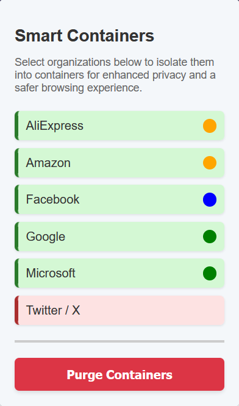

# **Smart Containers**

## **Overview**

Smart Containers is a **Firefox** extension that automatically organizes your tabs into isolated containers based on their domain. This enhances privacy, prevents cross-site tracking, and keeps your browsing experience more organized.



## **Features**

✅ Automatically isolates websites into separate containers  
✅ Prevents cross-site tracking and enhances security  
✅ Customizable container color  
✅ One-click purge button to clear container cookies and session data  

## **Installation**

### **Firefox Add-ons Store**

Click [here](https://addons.mozilla.org/en-US/firefox/addon/smart-containers/) to install.

### **Manual**

1.  Clone the repository:
    
    ```sh
    git clone https://github.com/davidlcassidy/smart-containers-extension.git
    cd smart-containers 
    ```
    
2.  In your Firefox browser, open `about:debugging#/runtime/this-firefox`.
3.  Click **"Load Temporary Add-on"**.
4.  Select the `manifest.json` file from your local folder.

## **Usage**

1.  Open the extension popup.
2.  Select the platforms to be automatically isolated in containers.
4.  Enjoy a cleaner, safer browsing experience!

## **Project Structure**

```bash
/
│── configs/
│   ├── containers.json   # Predefined container settings 
│── icons/
│── screenshots/
│── dashboard.html        # Popup interface
├── dashboard.js          # Handles UI interactions
│── background.js         # Handles tab management and container logic
│── manifest.json
│── README.md
│── LICENSE               # Project GNU GPLv3 License
``` 

## **Required Permissions**

-   **webRequest & webRequestBlocking:** Intercepts network requests to assign them to containers.
-   **cookies:** Ensures session isolation per container.
-   **tabs:** Moves tabs into the appropriate container.
-   **storage:** Saves user preferences for assigned containers.
-   **contextualIdentities:** Required for managing Firefox containers.

## **Contributing**

Pull requests are welcome! If you have suggestions or improvements, open an issue or submit a PR.

## **License**

This project is licensed under the GNU GPLv3 License. See the [LICENSE](https://github.com/davidlcassidy/smart-containers-extension/blob/master/LICENSE) file for details.
